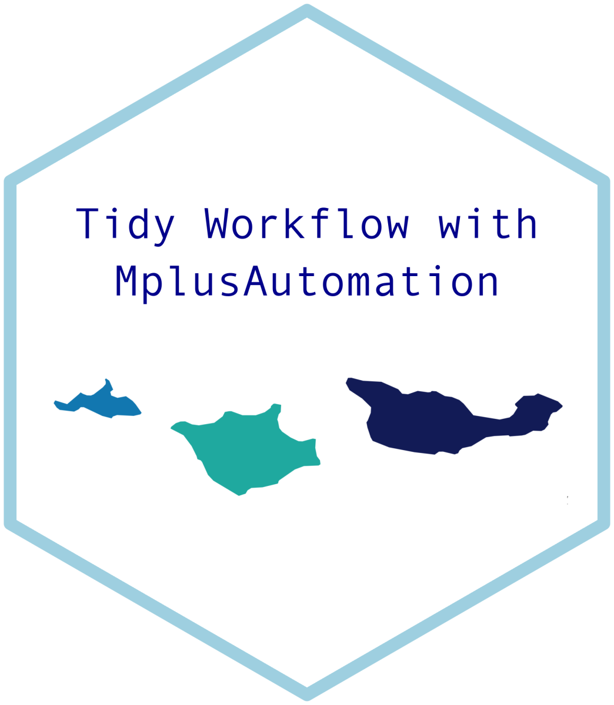

# NTNU  MplusAutomation Workshop

A course taught by Adam Garber for the Norwegian University of Science and Technology

***

This repository does not have Mplus models estimated. 

See associated repository with all Mplus models included (https://github.com/garberadamc/NTNU-workshop)

personal website - https://www.adam-garber.com/

course materials - https://garberadamc.github.io/project-site/

